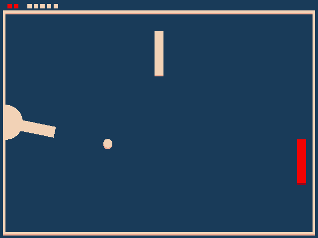

# Shooting Pong

Author: Tianjian Huang

Design: (TODO: In two sentences or fewer, describe what is new and interesting about your game.)

Screen Shot:

How To Play:

Your cannon is on the left side, and your target (red plate) is on the right side.
Other objects are obstacles.
Your goal is to shoot the target. When you hit you gain 1 point, but when you miss
you lose 1 health. The game is over when you remain zero health. Initially you have
3 healths.

------------------------------------------------------------------------------------

Operation:
LMB: shoot
Move mouse: adjust cannon direction
Esc: to the pause UI
Click "resume": continue to play
Click "quit": quit the game

Sources: 
https://github.com/cccyf/15-466-f20-base0/blob/master/PongMode.cpp

This game was built with [NEST](NEST.md).
